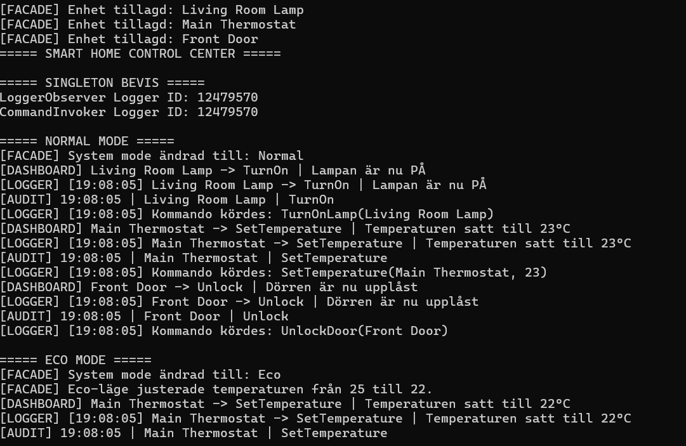
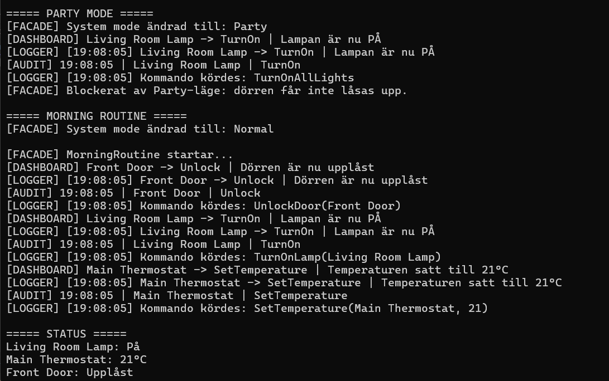
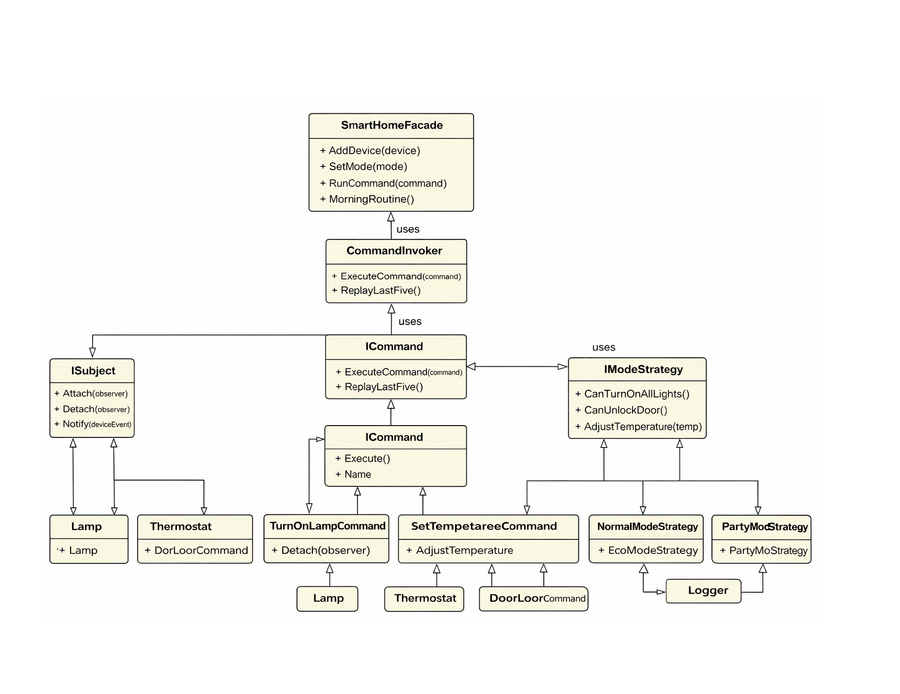

# Smart Home Control Center

## Description
This project is a simple Smart Home Hub built in C#. It allows the user to control different devices such as lamps, a thermostat, and a door lock. The system can run commands, switch between different modes, and provide live updates when something changes.

The goal of the project is to use design patterns in a practical way, not just as theory.

## How to run the program
1. Open the project in Visual Studio
2. Build the project
3. Run the program (F5)

The program will run a demo in the console showing how the system works.

## Design Patterns

### Observer
Observer is used to send live updates when a device changes state.

When something happens, multiple observers react:
- DashboardObserver
- LoggerObserver
- AuditObserver

This makes it easy to add more listeners without changing the devices.

### Command
Command is used to represent actions as objects.

Examples:
- TurnOnLampCommand
- SetTemperatureCommand
- UnlockDoorCommand

Commands are handled by a CommandInvoker which executes commands, stores history, and can replay recent commands.

### Strategy
Strategy is used to change how the system behaves depending on the selected mode.

Modes:
- NormalMode
- EcoMode
- PartyMode

Each mode controls rules like temperature limits and allowed commands without changing the main logic.

### Facade
SmartHomeFacade is used as a simple interface for the whole system.

The main program uses the facade to:
- add devices
- change mode
- run commands
- start routines

This keeps the main program clean and easier to understand.

### Singleton
The Logger is implemented as a Singleton.

This ensures that the whole system uses the same logger instance, so logging is consistent everywhere.

## Demo Output

The program demonstrates:
- live updates from observers
- different modes (Normal, Eco, Party)
- command execution and history
- replay of recent commands
- facade controlling the system

### Demo 1

### Demo 2

## Class Diagram

## Reflection
I tried to keep the system simple while still using design patterns where they actually solve a problem.

Observer works well for updates, Command helps structure actions, Strategy makes it easy to switch behavior, Facade simplifies usage, and Singleton ensures shared logging.

I focused on keeping the code modular and easy to follow rather than making it overly complex.
